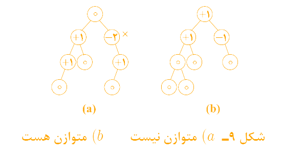
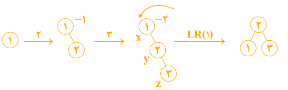
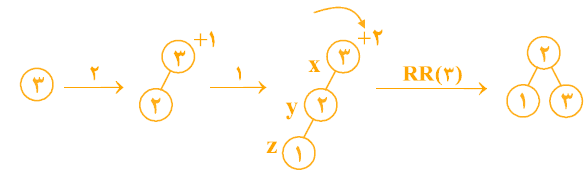
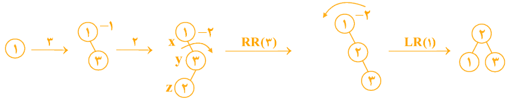
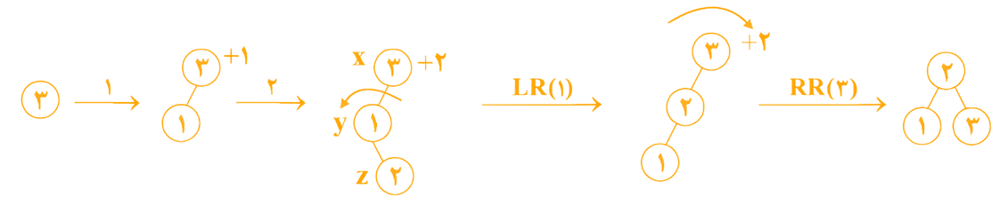
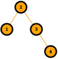
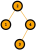
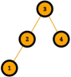
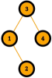
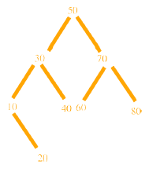

<div dir="rtl" align="right">


# 📚 درخت AVL Tree | AVL1


<div align="center">
  
### AVL &nbsp;&nbsp;&rBarr;&nbsp;&nbsp; Adelson - Velsky and Landis

</div>

درخت **AVL**، یک درخت **BST متوازن و بالانس** است.

💡 درخت متوازن &nbsp;&nbsp;&lBarr;&nbsp;&nbsp; درختی که فاکتور توازن هر گره برابر 1± یا 0 باشد.

💡 فاکتور توازن &nbsp;&nbsp;&lBarr;&nbsp;&nbsp; تعداد سطوح زیردرخت چپ &minus; تعداد سطوح زیردرخت راست

در واقع اگر درخت BST متوازن باشد، به آن AVL می‌گویند.

⚠️ **توجه:** درخت BST در حالت کلی **متوازن نیست**.

در شکل ۹ تعدادی درخت دودویی نشان داده شده‌اند که داخل هر نود، فاکتور توازن آن نوشته شده است. نودهایی که فاکتورشان 2± است، توازن را به هم زده‌اند.

<div align="center">
  


</div>

<h3 id="custom-id-1">📌 نکته:</h3>

اگر N(h) حداقل تعداد گره لازم برای ساخت AVL به ارتفاع h باشد، آنگاه:  

* برای ساخت AVL به ارتفاع صفر، فقط یک نود لازم است. &nbsp;&nbsp;&xlArr;&nbsp;&nbsp; **N(0) = 1**
* برای ساخت AVL به ارتفاع یک، حداقل دو نود لازم است. &nbsp;&nbsp;&xlArr;&nbsp;&nbsp; **N(1) = 2** 

<div align="center">
  
 &nbsp;&nbsp; یا &nbsp;&nbsp; 

</div>

* برای ساخت AVL به ارتفاع دو، حداقل چهار نود لازم است. &nbsp;&nbsp;&xlArr;&nbsp;&nbsp; **N(2) = 4** 

<div align="center">
  


</div>

به طور کلی برای ساخت AVL به ارتفاع h و با کمترین تعداد نود، کافی است سمت چپ ریشه تعداد **N(h - 1)** و سمت راست ریشه تعداد **N(h - 2)** نود قرار دهیم . پس:

<div align="center">
  
<h3 id="custom-id-2">

$\Large{N(h) = N(h - 1) + N(h - 2) + 1}$

</h3>

حداقل تعداد نودهای لازم برای ساخت **AVL** به ارتفاع **h**

</div>

برای مثال، برای ساخت AVL به ارتفاع سه، حداقل هفت نود لازم است. &nbsp;&nbsp;&xlArr;&nbsp;&nbsp; **N(3) = N(2) + N(1) + 1 = 4 + 2 + 1 = 7**

<div align="center">
  


</div>


می‌توان نتیجه گرفت که رشد تعداد گره‌ها نسبت به ارتفاع، به صورت زیر است:

<div dir="ltr" align="center">
  
```math
\Large{N(h) = \theta\left(\left(\frac{1 + \sqrt{5}}{2}\right) ^ h\right)}
```

</div>

این رابطه از حل معادلۀ بازگشتی فیبوناچی به دست می‌آید. بر همین اساس اگر بخواهیم ارتفاع (h) را برحسب تعداد نودها (n) بیان کنیم، خواهیم داشت:

<div dir="ltr" align="center">
  
```math
\Large{h = \theta\left(\log_{\frac{1 + \sqrt{5}}{2}}N(h)\right)}
```

</div>

این یعنی ارتفاع درخت AVL همواره از مرتبۀ **لگاریتمی** یا $\boldsymbol{\theta(\log n)}$ باقی می‌ماند. به همین دلیل، تمام عملیات‌های پایه در این درخت با سرعت بسیار بالا و از مرتبۀ $\boldsymbol{\mathcal{O}(\log n)}$ انجام می‌شوند:   

* جست‌وجو
* درج و حذف
* یافتن کمینه و بیشینه
* یافتن عنصر بعدی و قبلی

## 🛠 ساخت AVL
با تعدادی کلید، همانند ساخت درخت جستجوی دودویی، کلیدها را به ترتیب درج می‌کنیم. با هر عمل درج باید فاکتور توازن اجداد نود جدید را بررسی کنیم و اگر فاکتور توازن نودی 2+ یا 2- شده باشد، باید با عمل دوران، درخت را متوازن کنیم. با درج عنصر جدید z ممکن است تعدادی از اجداد نود z، دارای فاکتور توازن 2± شوند؛ که در این صورت باید به پایین‌ترین جد نود z، توجه کنیم. چهار حالت ممکن است پیش آید که با یک مثال نشان می‌دهیم و سپس حالات را بیان می‌کنیم. فرض کنید می‌خواهیم با کلیدهای 1 و 2 و 3 و ترتیب‌های مختلف، AVL بسازیم. به چهار حالت زیر توجه کنید:

### 🧩 حالت اول
به ترتیب با 1 و 2 و 3 (راست به چپ) AVL می‌سازیم.  
پس از درج عدد 3، فاکتور توازن نود 1 برابر 2- شده و دوران LR(1) انجام می‌شود.

<div align="center">
  


</div>

### 🧩 حالت دوم
به ترتیب با 3 و 2 و 1 (راست به چپ) AVL می‌سازیم.  
پس از درج عدد 1، فاکتور توازن نود 3 برابر 2+ شده و دوران RR(1) انجام می‌شود.

<div align="center">
  


</div>

### 🧩 حالت سوم
به ترتیب با 1 و 3 و 2 (راست به چپ) AVL می‌سازیم.  
ابتدا دوران RR(3) و سپس دوران LR(1) برای متوازن‌سازی انجام می‌شود.

<div align="center">
  


</div>

### 🧩 حالت چهارم
به ترتیب با 3 و 1 و 2 (راست به چپ) AVL می‌سازیم.  
ابتدا دوران LR(1) و سپس دوران RR(3) برای متوازن‌سازی انجام می‌شود.

<div align="center">
  


</div>

حال به بررسی هر چهار حالت می‌پردازیم. منظور از z، نود جدید است. x اولین جد z است که فاکتور توازنش 2+ یا 2- شده است و y فرزند x است که  در مسیر درج واقع است.

**حالت اول**  
🔸 y فرزند راست x است.  
🔸 z به زیردرخت راست y درج شده است.  
🔸 فاکتور توازن x برابر 2- شده است.  
🔸 در این حالت کافیست x را دوران به چپ (LR) بدهیم.   

**حالت دوم**  
🔸 y فرزند چپ x است.  
🔸 z به زیردرخت چپ y درج شده است.  
🔸 فاکتور توازن x برابر 2+ شده است.  
🔸 در این حالت کافیست x را دوران به راست (RR) بدهیم.

**حالت سوم**  
🔸 y فرزند راست x است.  
🔸 z به زیردرخت چپ y درج شده است.  
🔸 فاکتور توازن x برابر 2- شده است.  
🔸 در این حالت، ابتدا y را به راست و سپس x را به چپ دوران می‌دهیم.

**حالت چهارم**  
🔸 y فرزند چپ x است.  
🔸 z به زیردرخت راست y درج شده است.  
🔸 فاکتور توازن x برابر 2+ شده است.  
🔸 در این حالت، ابتدا y را به چپ و سپس x را به راست دوران می‌دهیم.


## 📝 سوالات

---

**سوال ۱)** با کلیدهای داده شده (از چپ به راست) AVL بسازید.

<div dir="ltr" align="left">

24, 40, 25, 30, 22, 70, 10, 60, 50, 20

</div>

<details>
<summary>👀 پاسخ</summary>
گزینه فلان ✅

> توضیحات
</details>

---

**سوال ۲)** با کلیدهای 1 و 2 و 3 و 4، چه تعداد AVL شامل 4 نود با کلیدهای متمایز می‌توان ساخت؟

<details>
<summary>👀 پاسخ</summary>
چهار تا می‌توان ساخت. ✅

<div align="left">

>    

</div>
</details>

---

**سوال ۳)** در یک درخت AVL به ارتفاع 4، لااقل چند گره وجود دارد؟

<div align="left">

(دولتی ۷۴)

</div>

گزینه ۱) 7  
گزینه ۲) 8  
گزینه ۳) 10  
گزینه ۴) 12

<details>
<summary>👀 پاسخ</summary>
گزینه ۱ ✅

[حداقل تعداد نودهای درخت AVL به ارتفاع h](#custom-id-1)
<div align="left">

>

</div>

</details>

---

**سوال ۴)** درخت AVL یک درخت دودوئی جستجو است که اختلاف  ارتفاع دو زیردرخت هر عنصر در آن حداکثر 1 باشد. با عناصر 1، 2، 3، 4 و 5 حداکثر چندتا درخت AVL می‌توان ساخت؟ (ارتفاع درخت تهی 1- فرض می‌شود)

<div align="left">

(دولتی ۸۵)

</div>

گزینه ۱) 5  
گزینه ۲) 6  
گزینه ۳) 7  
گزینه ۴) 8

<details>
<summary>👀 پاسخ</summary>

گزینه ۲ ✅

</details>

---

**سوال ۵)** درخت AVL یک درخت دودویی است که ارتفاع دو زیردرخت هر گره آن حداکثر یک واحد با هم اختلاف دارد. (ارتفاع یک درخت تهی را 1- فرض کنید). اگر T(h) کمترین تعداد گره برای یک درخت AVL به ارتفاع h باشد، کدام یک از روابط بازگشتی زیر برای T(h) صحیح است؟

<div align="left">

(دولتی ۷۹)

**(T(0) = 1 و T(1) = 1)**

1. $\large{T(h) = 2T(h - 2) + 1}$  

2. $\large{T(h) = T(h - 1) + T(h - 2) + 1}$  

3. $\large{T(h) = 2T(h - 1) + 1}$  

4. $\large{T(h) = T\left(\Bigl\lfloor\frac{h}{2}\Bigr\rfloor\right) + T\left(\Bigl\lceil\frac{h}{2}\Bigr\rceil\right) + 1}$

</div>

<details>
<summary>👀 پاسخ</summary>
گزینه ۲ ✅

> [رابطۀ بازگشتی حداقل تعداد نودهای درخت AVL به ارتفاع h](#custom-id-2)

</details>

---

**سوال ۶)** اگر به درخت AVL زیر کلید 15 اضافه شود، کدام گزینه بخشی از پیمایش Preorder درخت حاصل خواهد بود؟

<div align="left">

(۹۰ IT)



</div>

گزینه ۱) 30 و 40 و 15 و 10 و 20  
گزینه ۲) 40 و 15 و 20 و 10 و 30  
گزینه ۳) 40 و 20 و 10 و 15 و 30  
گزینه ۴) 40 و 15 و 10 و 20 و 30

<details>
<summary>👀 پاسخ</summary>
گزینه ۳ ✅

<div align="left">

> 80 60 70 ***40 20 10 15 30*** 50 &nbsp;&nbsp;&rBarr;&nbsp;&nbsp; پیمایش Preorder درخت حاصل

</div>

</details>

---

</div>


